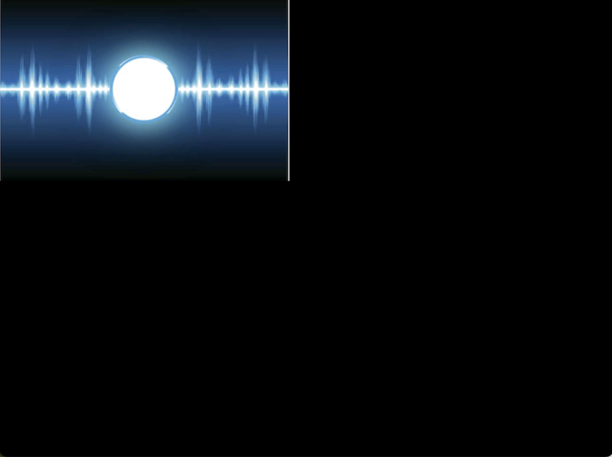

# NIBLETS FINAL PROJECTION

* Team Number: 12
* Team Name: Niblets
* Team Members: Claren Ogira, Patrick Zhao, Praise Ndlovu
* GitHub Repository URL: https://github.com/upenn-embedded/final-project-s25-niblets
* GitHub Pages Website URL: [for final submission]

## Final Project Proposal

### 1. Abstract

This project develops a digital audio device integrating an LCD, microphone, SD card, speaker, and microcontrollers for seamless audio playback, recording, and user interaction. The system ensures efficient communication, real-time performance, and reliable data storage. Validation includes display responsiveness, audio quality, and peripheral interfacing to optimize functionality and usability.

### 2. Motivation

This project builds a standalone digital audio device for recording, playback, and user interaction. It’s a hands-on dive into writing graphics, mastering serial protocols, and making hardware talk seamlessly. The goal? A fully functional, ready-to-use device—while leveling up in embedded systems and low-level programming!

### 3. System Block Diagram

*Show your high level design, as done in WS1 and WS2. What are the critical components in your system? How do they communicate (I2C?, interrupts, ADC, etc.)? What power regulation do you need?*

### 4. Design Sketches

*What will your project look like? Do you have any critical design features? Will you need any special manufacturing techniques to achieve your vision, like power tools, laser cutting, or 3D printing?*

We wll need 3D printing to print out a case for fitting all of our components in. We may also require screws to place our components in.

### 5. Software Requirements Specification (SRS)

*Formulate key software requirements here. Think deeply on the design: What must your device do? How will you measure this during validation testing? Create 4 to 8 critical system requirements.*

*These must be testable! See the Final Project Manual Appendix for details. Refer to the table below; replace these examples with your own.*

**5.1 Definitions, Abbreviations**

Here, you will define any special terms, acronyms, or abbreviations you plan to use for hardware

**5.2 Functionality**

| ID                                             | Description                                                                                                                                                                                                                                                                                        |
| ---------------------------------------------- | -------------------------------------------------------------------------------------------------------------------------------------------------------------------------------------------------------------------------------------------------------------------------------------------------- |
| SRS-01 - LCD Display Functionality             | The LCD must accurately render graphics and display the current state of the iPod, including menus, playback status, and user interactions.**Validation**: Verify display clarity, responsiveness, and update rate during different operations.                                              |
| SRS-02  Microphone Recording Capability        | The microphone must capture audio input with sufficient clarity and store it in a digital format when enabled.**Validation**: Record test samples and analyze audio quality, noise levels, and latency.                                                                                      |
| SRS-03 SD Card Storage & Read/Write Operations | The SD card module must support reading and writing data efficiently, ensuring reliable storage of music, recorded audio, and system logs.**Validation** Conduct read/write speed tests, check file integrity, and test compatibility with different SD card sizes.                          |
| SRS-04  Speaker Audio Output                   | The speaker must play sound accurately and at a sufficient volume without distortion when provided with an audio signal.**Validation** Measure frequency response, output power, and signal clarity under different playback conditions.                                                     |
| SRS-05  Microcontroller (MCU) Interfacing      | The microcontrollers must communicate seamlessly with each other and with peripherals such as the LCD, microphone, SD card, and speaker.**Validation** Perform communication protocol tests (e.g., I2C, SPI, UART), measure data transfer latency, and ensure stability under various loads. |
| SRS-06  User Interface Responsiveness          | The system shall provide an intuitive and responsive user interface for navigation and control.**Validation** Test button responsiveness, menu transitions, and overall usability during different operations.                                                                               |

### 6. Hardware Requirements Specification (HRS)

| ID                                         | Description                                                                                                                                                                                                                                                                                      |
| ------------------------------------------ | ------------------------------------------------------------------------------------------------------------------------------------------------------------------------------------------------------------------------------------------------------------------------------------------------ |
| HRS-01 - LCD Display                       | The LCD display must have a minimum resolution of 480x320 pixels and support clear, legible display of menus, playback status, and user interactions**Validation**: Verify display clarity, resolution, and update rate during different operations.                                       |
| HRS-02 - Microphone                        | The microphone must capture audio with high fidelity and low noise, providing clear input for recording and voice commands.**Validation**: Record test samples, analyze audio quality, noise levels, and latency.                                                                          |
| HRS-03 - SD Card Module                    | The SD card module must support reading and writing at fast speeds to efficiently handle large files such as audio and system logs.**Validation**: Conduct read/write speed tests, check file integrity, and test compatibility with different SD card sizes.                              |
| HRS-04 - Speaker                           | The speaker must provide clear and undistorted audio output, with sufficient volume for playback in typical environments.**Validation**: Measure frequency response, output power, and signal clarity under different playback conditions.                                                 |
| HRS-05 - Microcontroller (MCU)             | The microcontroller must manage the system’s components, handle user input, audio processing, and communication between peripherals.**Validation**: Perform communication protocol tests (e.g., I2C, SPI, UART), measure data transfer latency, and ensure stability under various loads. |
| HRS-06 - Power Supply                      | The power supply must support efficient power management to ensure optimal device operation and battery longevity.**Validation**: Measure power consumption under different workloads and test battery performance over extended usage.                                                    |
| HRS-07 - Buttons & User Interface Controls | Physical buttons or touch interface must allow the user to navigate the system and control media playback and settings.**Validation**: Test button responsiveness, UI transitions, and overall usability during different operations.                                                      |

**6.1 Definitions, Abbreviations**

Here, you will define any special terms, acronyms, or abbreviations you plan to use for hardware

**6.2 Functionality**

| ID     | Description                                                                                                                   |
| ------ | ----------------------------------------------------------------------------------------------------------------------------- |
| HRS-01 | The audio player shall support playback of audio files from the SD card, with support for common formats such as MP3 and WAV. |
| HRS-02 | The device shall include a play/pause button that toggles audio playback without delay.                                       |
| HRS-03 | The volume control shall allow the user to adjust audio output levels from silent to a maximum of 85 dB.                      |
| HRS-04 | The audio player shall support track navigation, allowing the user to skip forward or backward between audio tracks.          |
| HRS-05 | The device shall display the current track information, including title and duration, on the LCD screen.                      |
| HRS-06 | The speaker shall output clear and undistorted audio at all playback levels.                                                  |
| HRS-07 | The audio player shall automatically resume playback from the last position upon power-on, if no other track is selected.     |

### 7. Bill of Materials (BOM)

*What major components do you need and why? Try to be as specific as possible. Your Hardware & Software Requirements Specifications should inform your component choices.*

Some components that we will need are the ATMEGA328PB which we intend to utilize with the IMU since we already know how the two devices interface given our worksheet experience. We want to use the NUCLEO-F446RE as our main process since it is able to process mode data, which will be required when we are storing and playing music data, and since it has more pins that will allow us to interface with all of our components.

Some output components that we are using are our adafruit speaker, which we find to be standard, an audiojack to allow earbud use and an LCD display touch panel. We chose the LCD display with the touch functionality because of both its touch functionality and because of the bigger display and its wider range of colors.

Our choice of the omnidirectional microphone both reflected on the device's small size and the device's ability to internally process the data that it receives with its internal DAC. We realized that an internal DAC within the microphone would save us tremendous time when building out our device. The same internal DAC reasoning was used in our selection of the amplifier used.

Finally, the IMU we chose reflected an IMU that we are already familiar with and we chose larger buttons for a more consumer-oriented feel.

*In addition to this written response, copy the Final Project BOM Google Sheet and fill it out with your critical components (think: processors, sensors, actuators). Include the link to your BOM in this section.*
https://docs.google.com/spreadsheets/d/1H9uE5A8rThZXxHaYCtSz2vRuI-nbI0XPYlmzn1kPBnA/edit?gid=2071228825#gid=2071228825

### 8. Final Demo Goals

*How will you demonstrate your device on demo day? Will it be strapped to a person, mounted on a bicycle, require outdoor space? Think of any physical, temporal, and other constraints that could affect your planning.*

We will demonstrate our project in class. The end product will be small enough to fit on a table. The device may be connected to an external power source to supply power to the system. A quiet setup may be required to hear the audio produced by the device, and to record audio using the microphone.

### 9. Sprint Planning

*You've got limited time to get this project done! How will you plan your sprint milestones? How will you distribute the work within your team? Review the schedule in the final project manual for exact dates.*

| Milestone  | Functionality Achieved                                                                                                                                                                                                                                                                                          | Distribution of Work                                                                                                                                                                                       |
| ---------- | --------------------------------------------------------------------------------------------------------------------------------------------------------------------------------------------------------------------------------------------------------------------------------------------------------------- | ---------------------------------------------------------------------------------------------------------------------------------------------------------------------------------------------------------- |
| Sprint #1  | MicroSD Card Reading. LCD turning on with basic graphic functionality. Microphone recording voice. IMU sending understandable data to device. Speaker should be playing some audio that is controllable by both processors. Serial protocols all should be completed as well                                    | Claren - Microphone voice recording, Praise - LCD turning on with basic graphics, Patrick - Speaker playing audio and SD card reading                                                                      |
| Sprint #2  | Start integration of components. Get audio jack working with amplifier. Start playing music through SD card read through speaker and be able to store recorded audio. Buttons should start controlling board features. LCD screen should display a more understandable graphic. CAD of case should be designed. | Patrick - Design CAD of case. Praise - Playing music through SD card and selection through LCD screen. Claren - Connect audio jack with amplifier and play music through earbuds.                          |
| MVP Demo   | All components connected and fit inside case. Working minimal demo of song selection and music playing through device.                                                                                                                                                                                          | Patrick - Assembling case, soldering needs. Praise - Connect all of the software components together to play audio. Claren - Work on graphics of LCD screen to allow song selection and better experience. |
| Final Demo | Hopefully little to no work left here. Finish any features that were left unfinished from MVP. Program better graphics in the processor for the LCD                                                                                                                                                             | Patrick, Praise, Claren - Work on assorted problems to debug at finish ine.                                                                                                                                |

**This is the end of the Project Proposal section. The remaining sections will be filled out based on the milestone schedule.**

## Sprint Review #1

### Last week's progress

Patrick - I have been working through interfacing our ATMEGA328PB with the SD card reader using SPI which has been difficult. I've conducted some research and found the FATfs library as a way of file management and reading the data through buffers. I was able to change the configurations of an example FATfs project from ATMEGA1284P to our current device, but I think there are still some issues with the current configurations. Below is a picture of us interacting with the FATfs library after we ran it on our ATMEGA where we are able to initalize mounting, but the file reader isn't displaying any values even though the SD card reader board and SD card reader is connected to our microcontroller. The bulk of the work went into reading through the library and understanding how each part of it works mechanically which has taken a long time.
``

The code is too long to place here, so we've included a screenshot of us interfacing FATfs with the ATMEGA328PB (most of the program memory is consumed by the library!)

Please refer to the FATfs library code that we've uploaded and have been modifying.

Below is a picture of our wired AVR with our SD Card Reader Board.

Claren - I worked on setting up the I2S protocol betweeen the Atmega328PB and the INMP 441 microphone. The remaining task regarding this is interfacing with the rest of the project components. Below are the updates from this week's work:

Logic Analyzer Images

For the logic analyzer images below, Channels 0, 1, and 2 refer to SDA, SCL and WS respectively.

According to the datasheet, SDA stays low for 2^18 clock cycles. I found this to be about 70ms which we should account for in our readings. This could be accounted for by a delay or maybe boot other operations as the microphone sets up.

The values printed on the serial terminal:

Praise - I have been setting up our STM32 project and writing the initialization code for all the essential peripherals. This includes configuration for GPIOs, I2C, SPI, timers, and syscalls, which form the foundation of our embedded application. The SPI interface is still undergoing testing: I attempted to communicate with the ICM-20948 IMU using SPI, and so far, I have received 0x0F as a response when reading the WHO_AM_I register, which suggests a fault or misconfiguration. I am currently debugging this by checking the SPI settings (mode, prescaler, CS handling) and verifying physical connections.

In parallel, I have also been working on the LCD module. It is partially functional—some data is being displayed, but the refresh rate is too low, and output only appears on half of the screen. I suspect this is due to incomplete initialization, possibly missing one or more commands required by the LCD controller’s startup sequence. I am currently cross-referencing the controller datasheet with the initialization routine.

To speed up development and reduce iteration time, I created a simulation workspace on my laptop that uses SDL graphics to simulate the GUI. This allows us to test the visual components of the UI before deploying them on hardware. The SDL environment is functioning properly and mimics our target LCD resolution and layout.

Lastly, I wrote a bitmap-to-pixel conversion utility to convert any image into the pixel array format required by our LCD driver. This will make it much easier to render static images or UI elements such as logos or backgrounds.

I’ll upload screenshots of the partial LCD display and simulated GUI once we finalize the layout. The current SPI and LCD code is being refined and will be pushed to GitHub once it stabilizes.

### Current state of project

In terms of parts, we have everything we need and don't expect to need anything in the near future. One of us also has a 3D printer that we have ready access to which we will use for making the case so there shouldn't be any problems.

We haven't been able to read data from an SD card yet which we expected to be the hardest part of this project. We intend to work on this throughout this weekend to fix this problem and get it reading txt files first, and then read WAV files from the SD card. The problem is that the SD card isn't being recognized which we suspect is an issue with our setup.

### Next week's plan

1. Reading data from the SD card ` `
   a. We expect this to take another 5 hours. Debugging the code is taking a long time and requires use to better understand the FATfs library for file management.  ` `
   b. Patrick and Praise  ` `
   c. When we run the example code provided by the FATfs library for AVR, we want that when we write "fl /" to the serial terminal to see a return of FR_OKAY and of the    folders in the SD card.  ` `
   d. Since we are listening to music from SD card readings, we need our Atmega328pb board to be able to extract music data from an SD card and play it later. To accomplish this, we need to utilize a file management system that lets us select specific files and which we will then read and use to play music. We were able to find code online that we can use as a file management system, but reading and understanding the code has taken a long time. We are also configuring the code that we found online to fit our device as well as our needs. We need to make sure that this completely works before we can start playing data and doing other things. If reading from the SD card doesn't work by Monday, we are planning to use data from the cloud instead by using an ESP32 and sending data from there into the STM32. ` ` ` `
2. Integrate data reading from SD card onto STM  ` `
   a. We expect this to take 3 hours. Once we have data reading from SD card onto the AVR, we can easily shift it onto the STM32 given we change some of the input / output ports.   ` `
   b. Praise  ` `
   c. We want the STM to be able to read data from our input on an SD card and then to print the names of the files inside of the SD card.  ` `
   d. We need to make sure that the STM is able to read data in the same way as we program the AVR.  ` `  ` `
3. Playing music from data read on STM  ` `
   a. We expect this to take 5 hours. Once we are able to read data from the SD card onto the STM, we need to be able to interpret that data and play it on our mono speaker  ` `
   b. Claren and Patrick  ` `
   c. We ultimately want to play a simple song (like twinkle twinkle) and see if we are able to play it through our mono speaker. We want the sound quality to be recognizable.  ` `
   d. This is one of the more essential parts of our project, we need to be able to play music that we read from the STM. This will involve getting the data from the WAV files that we load onto our STM and being able to convert them to frequencies to play on our speaker.   ` ` ` `
4. CADing a case to contain everything ` `
   a. We expect this to take 8 hours. We need to CAD a case both large enough to contain all of our components while also being small enough that can be handheld. ` `
   b. Patrick ` `
   c. For this task to be finished, I want to have created a CAD that contains all of our components within.` `
   d. This is a very important step in terms of creating housing for our device. We need to start early in terms of building our case because we will probably want to iterate in the future and printing will take a lot of time. ` `
5. Fix SPI communication with IMU (ICM-20948) ` `

    a. Estimated time: 4 hours` `

    b. Assigned to: Praise` `

    c. Definition of done: Reading the correct WHO_AM_I value (0xEA) from the IMU via SPI consistently.` `

    d. Detailed: This involves confirming SPI timing, polarity, and chip-select handling. If needed, I’ll use a logic analyzer to verify the signals.` ` ``

6. Debug and finalize LCD initialization ` `

    a. Estimated time: 5 hours` `

    b. Assigned to: Praise` `

    c. Definition of done: Full-screen content is displayed correctly with stable refresh rates and no visible flickering.` `

    d. Detailed: I’ll review command sequences from the datasheet and compare them with known-good examples online. If the issue persists, I will test alternate initialization sequences.`  `

7. Push finalized SPI and LCD code to GitHub ` `

    a. Estimated time: 1 hour` `
    b. Assigned to: Praise ` `
    c. Definition of done: SPI and LCD drivers are committed with documentation and usage examples in the repository.` `
    d. Detailed: I will add comments and organize the code into modular drivers with initialization and usage APIs.`  `

8. Integrate LCD GUI elements using SDL simulation output ` ` 

    a. Estimated time: 3 hours` `
    b. Assigned to: Praise ` `
    c. Definition of done: At least two GUI screens (e.g., boot screen and music selection screen) working in the simulation and partially on the real LCD.` `
    d. Detailed: I will transfer the screen logic from SDL to the hardware LCD once it displays correctly in the simulation.`  `

## Sprint Review #2

### Last week's progress

### Current state of project

### Next week's plan

## MVP Demo

1. Show a system block diagram & explain the hardware implementation.
2. Explain your firmware implementation, including application logic and critical drivers you've written.
3. Demo your device.
4. Have you achieved some or all of your Software Requirements Specification (SRS)?

   1. Show how you collected data and the outcomes.
5. Have you achieved some or all of your Hardware Requirements Specification (HRS)?

   1. Show how you collected data and the outcomes.
6. Show off the remaining elements that will make your project whole: mechanical casework, supporting graphical user interface (GUI), web portal, etc.
7. What is the riskiest part remaining of your project?

   1. How do you plan to de-risk this?
8. What questions or help do you need from the teaching team?

## Final Project Report

Don't forget to make the GitHub pages public website!
If you’ve never made a GitHub pages website before, you can follow this webpage (though, substitute your final project repository for the GitHub username one in the quickstart guide):  [https://docs.github.com/en/pages/quickstart](https://docs.github.com/en/pages/quickstart)

### 1. Video

[Insert final project video here]

* The video must demonstrate your key functionality.
* The video must be 5 minutes or less.
* Ensure your video link is accessible to the teaching team. Unlisted YouTube videos or Google Drive uploads with SEAS account access work well.
* Points will be removed if the audio quality is poor - say, if you filmed your video in a noisy electrical engineering lab.

### 2. Images

[Insert final project images here]

*Include photos of your device from a few angles. If you have a casework, show both the exterior and interior (where the good EE bits are!).*

### 3. Results

*What were your results? Namely, what was the final solution/design to your problem?*

#### 3.1 Software Requirements Specification (SRS) Results

*Based on your quantified system performance, comment on how you achieved or fell short of your expected requirements.*

*Did your requirements change? If so, why? Failing to meet a requirement is acceptable; understanding the reason why is critical!*

*Validate at least two requirements, showing how you tested and your proof of work (videos, images, logic analyzer/oscilloscope captures, etc.).*

| ID     | Description                                                                                               | Validation Outcome                                                                          |
| ------ | --------------------------------------------------------------------------------------------------------- | ------------------------------------------------------------------------------------------- |
| SRS-01 | The IMU 3-axis acceleration will be measured with 16-bit depth every 100 milliseconds +/-10 milliseconds. | Confirmed, logged output from the MCU is saved to "validation" folder in GitHub repository. |

#### 3.2 Hardware Requirements Specification (HRS) Results

*Based on your quantified system performance, comment on how you achieved or fell short of your expected requirements.*

*Did your requirements change? If so, why? Failing to meet a requirement is acceptable; understanding the reason why is critical!*

*Validate at least two requirements, showing how you tested and your proof of work (videos, images, logic analyzer/oscilloscope captures, etc.).*

| ID     | Description                                                                                                                        | Validation Outcome                                                                                                      |
| ------ | ---------------------------------------------------------------------------------------------------------------------------------- | ----------------------------------------------------------------------------------------------------------------------- |
| HRS-01 | A distance sensor shall be used for obstacle detection. The sensor shall detect obstacles at a maximum distance of at least 10 cm. | Confirmed, sensed obstacles up to 15cm. Video in "validation" folder, shows tape measure and logged output to terminal. |
|        |                                                                                                                                    |                                                                                                                         |

### 4. Conclusion

Reflect on your project. Some questions to address:

* What did you learn from it?
* What went well?
* What accomplishments are you proud of?
* What did you learn/gain from this experience?
* Did you have to change your approach?
* What could have been done differently?
* Did you encounter obstacles that you didn’t anticipate?
* What could be a next step for this project?

## References

Fill in your references here as you work on your final project. Describe any libraries used here.
